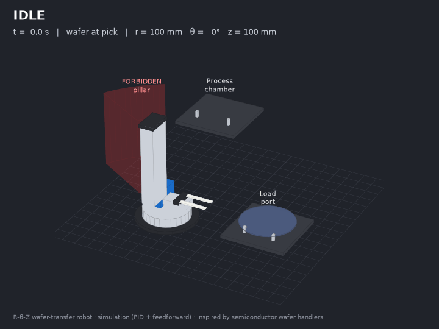
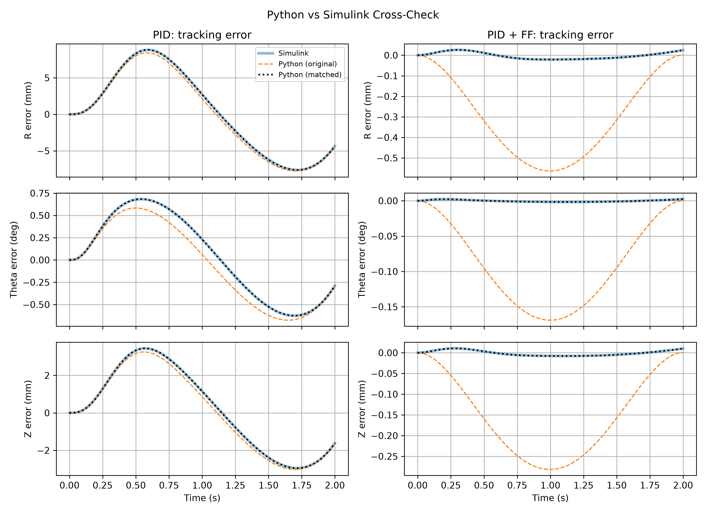
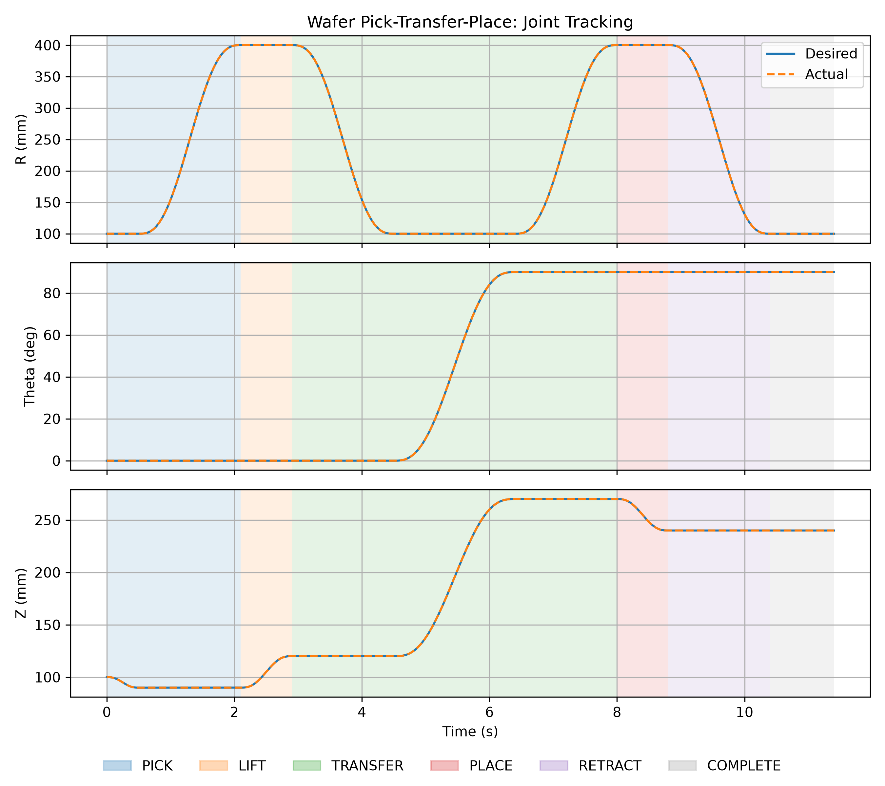
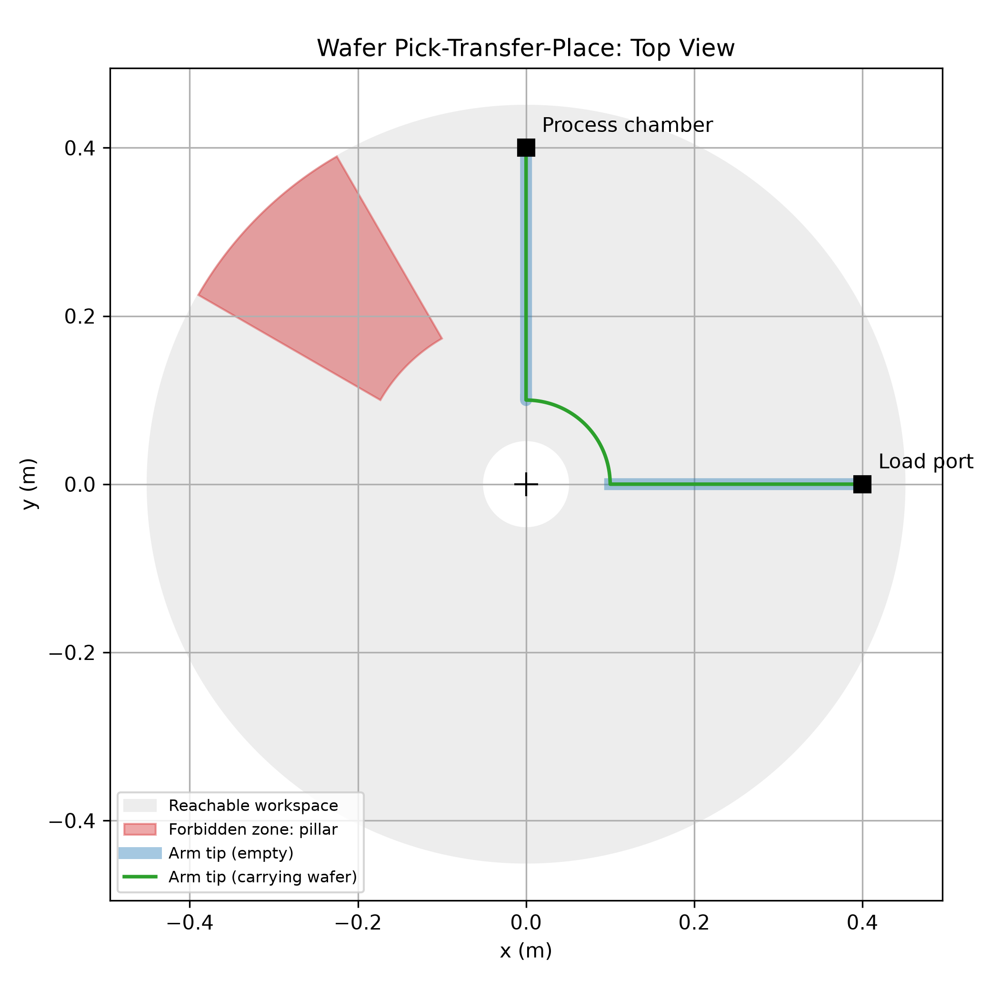
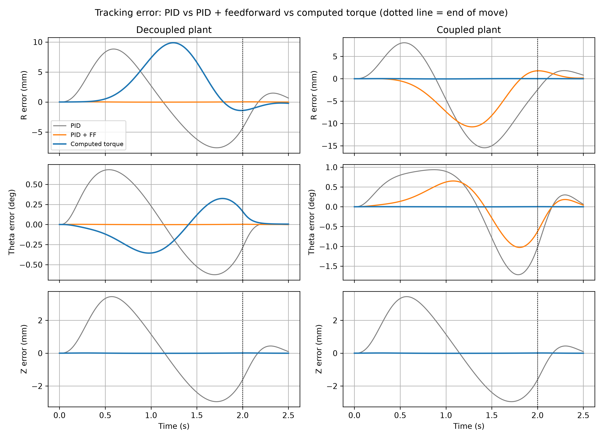

# Wafer-Transfer Motion Control Robot

A simulation and control framework for a cylindrical R-θ-Z wafer-transfer
robot. It covers kinematics, quintic trajectories, decoupled and coupled
dynamics, three controllers (PID, PID with feedforward, and computed torque),
actuator limits, a safety layer with forbidden zones, a pick-transfer-place
state machine, a cross-check against MATLAB/Simulink, and a ROS 2 package
that runs on ROS 2 Jazzy with RViz.

The robot is loosely inspired by the R-θ-Z handlers used in semiconductor
fabs, but it is not a model of any commercial robot. All numbers below come from simulating this model with the
chosen parameters; none of them are measurements.



The animation shows one simulated pick-transfer-place cycle. The arm retracts
before it rotates, so it passes underneath the forbidden zone (shown in red).

## Project layout

There are three parts. They share the same model and parameters.

| Part | Technology | Contents |
|---|---|---|
| **1** | **Python** ([src](src/), [simulation](simulation/), [tests](tests/)) | Models, controllers, safety layer, state machine, and simulation scripts, with **48 tests**. |
| **2** | **ROS 2** ([ros2](ros2/)) | [`wafer_transfer_robot`](ros2/src/wafer_transfer_robot) package with **five nodes**, a URDF, launch files, and an RViz config. See [`ros2/README.md`](ros2/README.md). |
| **3** | **MATLAB/Simulink** ([matlab](matlab/)) | Simulink models of each axis and the full robot, plus controller and disturbance studies. See [`matlab/README.md`](matlab/README.md). |

The design reasoning behind the results is written up in
[docs/engineering_notes.md](docs/engineering_notes.md).

## Model

The joint coordinates are q = [r, θ, z] in metres, radians and metres. Most
of the studies use a decoupled model
([src/robot_dynamics.py](src/robot_dynamics.py)), with no Coriolis or
centrifugal terms:

$$
\begin{aligned}
m_r \ddot{r} + b_r \dot{r} &= F_r \\
J_\theta \ddot{\theta} + b_\theta \dot{\theta} &= T_\theta \\
m_z \ddot{z} + b_z \dot{z} + m_z g &= F_z
\end{aligned}
$$

with m_r = 5 kg, b_r = 1 N·s/m, J_θ = 0.5 kg·m², b_θ = 0.1 N·m·s/rad,
m_z = 4 kg and b_z = 1 N·s/m.

The limits and gains for each axis are:

| | R | θ | Z |
|---|---|---|---|
| Actuator limit | ±100 N | ±20 N·m | 0 to 100 N (upward only) |
| Workspace | 0.05 to 0.45 m | ±180° | 0.05 to 0.30 m |
| Max velocity, acceleration | 0.5 m/s, 1.0 m/s² | 2.0 rad/s, 4.0 rad/s² | 0.2 m/s, 0.5 m/s² |
| PID gains (Kp, Ki, Kd) | 300, 20, 30 | 100, 5, 10 | 300, 20, 30 |

The velocity and acceleration limits are there to protect the wafer rather
than the motors, and they are what sets the motion time.

The coupled model ([src/coupled_dynamics.py](src/coupled_dynamics.py)),
used in section 5, treats the radial stage as a point mass
m_r at radius r. This makes the rotational inertia depend on reach and adds
centrifugal and Coriolis terms:

$$
\begin{aligned}
m_r (\ddot{r} - r \dot{\theta}^2) + b_r \dot{r} &= F_r \\
(J_0 + m_r r^2) \ddot{\theta} + 2 m_r r \dot{r} \dot{\theta} + b_\theta \dot{\theta} &= T_\theta \\
m_z \ddot{z} + b_z \dot{z} + m_z g &= F_z
\end{aligned}
$$

where J_0 = 0.5 kg·m² is the inertia of the turret itself.

The PID ([src/controller.py](src/controller.py)) and PID with feedforward
([src/feedforward_controller.py](src/feedforward_controller.py)) controllers
run at a fixed sample time: 2 ms in the Python and Simulink
studies and 10 ms in ROS 2. The feedforward term is m·q̈_ref + b·q̇_ref, plus
m_z·g on the Z axis.

## Results

### 1. PID vs PID with feedforward, checked against Simulink

The reference move takes 2 s and goes from r = 0.1 to 0.4 m, θ = 0 to 90° and
z = 0.1 to 0.25 m. The Python version (RK4 plant, sampled controller) and the
Simulink model agree to within 5×10⁻¹³ mm at every sample, so the numbers
below hold for both.

| Controller | R RMSE / max | θ RMSE / max | Z RMSE / max |
|---|---|---|---|
| PID | 5.670 / 8.829 mm | 0.467 / 0.683° | 2.217 / 3.444 mm |
| PID + FF | 0.016 / 0.026 mm | 0.001 / 0.002° | 0.006 / 0.011 mm |



An earlier version of the Python scripts reported 0.36 mm RMSE for PID + FF.
Most of that turned out to be a timing artifact: the loop compared the
reference at step i with the position from step i − 1, which on its own gives
an error of about velocity × dt (0.28 m/s × 2 ms ≈ 0.56 mm). All of the
scripts now use the sampled timing.
[simulation/simulink_validation.py](simulation/simulink_validation.py) still
runs the old loop next to the new one so the difference can be seen. The
[engineering notes](docs/engineering_notes.md#1-python-vs-simulink-what-the-cross-check-found)
go through this in more detail.

### 2. Disturbances, sensor noise and model mismatch (Simulink)

This study uses the same move, with sensor noise switched on and a step
disturbance at t = 2.5 s: 2 N on R, 0.5 N·m on θ, and on Z the weight of a
128 g wafer being picked up. Four controllers were compared:

- A: PID
- B: PID + FF
- C: PID + FF, retuned by pole placement (ω = 15 rad/s, filtered derivative)
- D: C, with the wafer's weight added to the Z feedforward at pick-up

On the R axis:

| | RMSE, nominal plant | RMSE, plant 20% heavier | Disturbance peak | Recovery to 0.1 mm |
|---|---|---|---|---|
| A | 5.670 mm | 6.971 mm | 8.551 mm | not within the window |
| B | 0.016 mm | 1.159 mm | 8.304 mm | not within the window |
| C | 0.003 mm | 0.045 mm | 0.447 mm | 0.39 s |

On the Z axis, B has 24.3 mm RMSE on the heavier plant and a 5.02 mm error
when the wafer is picked up. Retuning (C) brings these down to 0.689 mm and
0.363 mm. Adding the payload feedforward (D) reduces the pick-up error to
0.007 mm.

Feedforward removes nearly all of the tracking error when the model is
correct. It does nothing for a wrong model or an unexpected force; that has
to come from feedback, and the baseline gains are too soft for it. The full
tables are in
[matlab/results/controller_comparison.csv](matlab/results/controller_comparison.csv).

### 3. Safety layer

[SafetyMonitor](src/safety.py) checks position, velocity and acceleration limits, and whether
the arm enters any forbidden zone. A forbidden zone is a cylindrical wedge,
for example a pillar between 120° and 150° at 0.20 to 0.45 m reach. Every
trajectory is checked in full before it runs. A move that is too fast is
rejected, and so is a move through a zone. The arm is allowed to pass under
a zone while retracted.

### 4. Wafer pick-transfer-place

[WaferTransferSequence](src/wafer_transfer.py) goes through the states IDLE, PICK, LIFT, TRANSFER,
PLACE, RETRACT and COMPLETE. The fork approaches 1 cm below the wafer, lifts
it, retracts before rotating, extends, lowers the wafer and retracts again.
Each move is given the shortest duration that keeps every joint within its
velocity and acceleration limits, plus a 20% margin. If a station lies inside
a forbidden zone, the sequence goes to FAULT and no plan is produced.

Running the sequence with PID + FF
([simulation/wafer_transfer_simulation.py](simulation/wafer_transfer_simulation.py))
takes 10.4 s of motion. The peak tracking errors are 0.049 mm on R, 0.003° on
θ and 0.028 mm on Z. The largest radial force is 3.6 N out of the 100 N
available. The arm stays inside the workspace and never enters the forbidden
zone.





### 5. Coupled dynamics and computed torque

Here the same 2 s move is run on both the decoupled and the coupled plant,
using the controller in
[src/computed_torque_controller.py](src/computed_torque_controller.py).
Moving r, θ and z together is the worst case for coupling. The
computed-torque controller uses the PID gains divided by each axis' nominal
inertia. On the decoupled plant this makes it almost the same controller as
PID + FF, so any difference on the coupled plant comes from modelling the
coupling rather than from higher gains.

On the coupled plant:

| Controller | R RMSE / max | θ RMSE / max | Z RMSE / max |
|---|---|---|---|
| PID | 8.738 / 15.448 mm | 0.929 / 1.718° | 2.217 / 3.444 mm |
| PID + FF (decoupled model) | 5.573 / 10.767 mm | 0.521 / 1.028° | 0.006 / 0.011 mm |
| Computed torque (coupled model) | 0.024 / 0.041 mm | 0.001 / 0.002° | 0.006 / 0.011 mm |



Once the inertia changes with reach, the decoupled feedforward loses most of
its advantage: its R error goes from 0.016 mm to 5.57 mm RMSE. Computed
torque with the matching model keeps the error below 0.05 mm, and no actuator
saturates (the peak torque is 2.6 N·m out of 20). It also works the other way
round. On the decoupled plant, computed torque compensates for coupling that
isn't there and gives 5.06 mm RMSE, so a model-based controller is only as
good as its model. In the actual wafer-transfer sequence the robot only
rotates when the arm is retracted to r = 0.1 m, which keeps coupling small.
This study moves all three axes at once on purpose.

Running
[simulation/coupled_controller_comparison.py](simulation/coupled_controller_comparison.py)
prints the full
results for both plants: RMSE, maximum and final error, peak effort and
saturation.

### 6. ROS 2

The ROS 2 system has five nodes (sequence, safety, controller, simulator and
kinematics), plus robot_state_publisher and RViz. The safety node checks
every plan again on its own, without relying on the planner. The controller
looks up the reference by timestamp, and on any fault it brings the robot to
a controlled stop along the path that was already checked. See
[ros2/README.md](ros2/README.md) for details.

On ROS 2 Jazzy (on [The Construct](https://app.theconstruct.ai/)), the run went through all states in order
in 10.4 s. The peak tracking errors were 0.250 mm on R, 0.014° on θ and
0.145 mm on Z, which matches the offline check. A planner deliberately made
to ignore the forbidden zone produced a plan through it, and the safety node
rejected that plan. A manual stop in the middle of the transfer braked at no
more than 0.83 m/s², against an R limit of 1.0 m/s², without reversing.

## Running

```bash
# Python (Windows, from this folder)
.venv\Scripts\activate
pytest -v                                      # 48 tests
python simulation/wafer_transfer_simulation.py
python simulation/simulink_validation.py       # uses matlab/results/*.csv
python simulation/coupled_controller_comparison.py
python simulation/animate_wafer_transfer.py    # the GIF at the top

# MATLAB R2024b (from the matlab/ folder)
run('scripts/export_validation_data.m')        # CSVs for the Python cross-check
run('scripts/run_controller_comparison.m')

# ROS 2 node logic without ROS installed
python ros2/offline_check/run_system.py
```

Instructions for running on ROS 2 itself are in [ros2/README.md](ros2/README.md).

## Limitations

The coupled model treats the radial stage as a point mass at r, which gives
an upper bound on the coupling. The Simulink models and the ROS 2 nodes still
use the decoupled model. The forbidden-zone check looks only at the fork tip,
not at the full outline of the wafer. The plant parameters are illustrative
and were not identified from any hardware.

## Acknowledgements

I built this with help from an AI coding assistant (Claude, by Anthropic),
which I referred to for parts of the code, the ROS 2 package, the
MATLAB/Simulink build scripts and the documentation.

## License

MIT, see [LICENSE](LICENSE).
