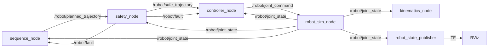

# ROS 2 package: wafer_transfer_robot

This is the ROS 2 (Jazzy) version of the wafer pick-transfer-place
simulation. The nodes reuse the tested Python modules from [../src](../src), which
[sync_core.py](sync_core.py) copies into the package. As a result the ROS system runs the
same planner, safety checks, controller and dynamics as the Python
simulations. Like the rest of the project, it is inspired by semiconductor
wafer-transfer robots but does not model any commercial robot.

## Architecture



There are five nodes:

- [sequence_node](src/wafer_transfer_robot/wafer_transfer_robot/sequence_node.py) runs the state machine (IDLE, PICK, LIFT, TRANSFER, PLACE,
  RETRACT, COMPLETE) and publishes the whole plan once. It also publishes the
  wafer state and the RViz markers.
- [safety_node](src/wafer_transfer_robot/wafer_transfer_robot/safety_node.py) checks every point of the plan against the joint limits and
  forbidden zones, and forwards it only if it is safe. It also watches the
  measured state and publishes /robot/fault if anything goes wrong.
- [controller_node](src/wafer_transfer_robot/wafer_transfer_robot/controller_node.py) runs PID with feedforward on each axis and publishes the
  joint commands and tracking error. On a fault it stops the robot smoothly
  along the checked path.
- [robot_sim_node](src/wafer_transfer_robot/wafer_transfer_robot/robot_sim_node.py) integrates the robot dynamics with RK4 and acts as the
  simulation clock (/clock).
- [kinematics_node](src/wafer_transfer_robot/wafer_transfer_robot/kinematics_node.py) computes the fork position from the joint state
  (/robot/ee_pose and /robot/ee_path).

A few design choices are worth explaining. The planner already checks its
own moves, but the safety node checks them again so that a planner bug
cannot lead to an unsafe motion; you can try this with unsafe_planner:=true.

Every node other than robot_sim_node uses sim time. The controller looks up
the reference at each measurement's timestamp, so message delays do not show
up as tracking error. In the offline tests, comparing against the current
reference instead raised the error from 0.25 mm to 4.2 mm at 100 Hz.

After any message on /robot/fault, a moving robot slows down along the path
it has already been cleared to follow, staying within the acceleration
limits. An earlier version simply braked as hard as the PID could, which
overshot by 23 mm and then reversed.

## Running it on The Construct

1. In your wafer_transfer_robot rosject, open the IDE and upload
   wafer_transfer_robot.zip into ros2_ws/src (right-click the folder and
   choose Upload Files, or drag and drop).
2. In a terminal:

   ```bash
   cd ~/ros2_ws/src
   unzip -o wafer_transfer_robot.zip && rm wafer_transfer_robot.zip
   cd ~/ros2_ws
   colcon build --packages-select wafer_transfer_robot --symlink-install
   source install/setup.bash
   ros2 launch wafer_transfer_robot wafer_transfer.launch.py
   ```

3. Open Graphical Tools to see RViz. It shows the robot, both stations, the
   forbidden zone in red, and the wafer moving onto the fork and off again.

Some variations to try:

```bash
# Process chamber beyond the pillar: the arm retracts and swings under it
ros2 launch wafer_transfer_robot wafer_transfer.launch.py place_theta_deg:=170.0

# Chamber inside the forbidden zone: the planner refuses, robot stays still
ros2 launch wafer_transfer_robot wafer_transfer.launch.py place_theta_deg:=135.0

# Same, with a simulated planner bug: the safety node rejects the plan
ros2 launch wafer_transfer_robot wafer_transfer.launch.py place_theta_deg:=135.0 unsafe_planner:=true

# Stop the robot mid-move (in a second terminal, while it is moving).
# /robot/fault is latched (transient local), so the publisher must be too,
# otherwise ROS never connects it to the nodes and the command just waits.
ros2 topic pub --once --qos-durability transient_local --qos-reliability reliable   /robot/fault std_msgs/msg/String "{data: 'manual stop'}"

# Check the URDF alone with joint sliders
ros2 launch wafer_transfer_robot display.launch.py
```

### Recording a GIF

[tools/record_rviz_gif.py](tools/record_rviz_gif.py) grabs the RViz window directly from the X display,
so ffmpeg isn't needed, and crops it to the 3D view:

```bash
pip install --target /tmp/xlibpkg python-xlib
~/replay.sh 0; sleep 3.5
PYTHONPATH=/tmp/xlibpkg python3 record_rviz_gif.py ~/wafer_transfer_rviz.gif 16 10
```

### Watching it again

[tools/replay.sh](tools/replay.sh) restarts the whole run, including RViz, and
[tools/stop_robot.sh](tools/stop_robot.sh) stops it. Copy both to the ROS machine (for example to
your home directory) and run:

```bash
~/replay.sh 5                          # start in 5 s: open Graphical Tools meanwhile
~/replay.sh 5 place_theta_deg:=170.0   # any launch argument can be passed on
~/stop_robot.sh
```

A few things I ran into on The Construct:

- Stopping only the ros2 launch process can leave its nodes running. Two
  simulators then publish conflicting /clock messages. stop_robot.sh stops
  everything.
- The browser viewer (Graphical Tools) disconnects whenever the last window
  on the display closes, which happens when RViz restarts. replay.sh keeps a
  minimised xterm open to prevent this. If the viewer still says
  Disconnected, close it and reopen it from the wrench icon.
- If you restart only the robot nodes and leave RViz running, the simulation
  clock jumps back to zero. RViz then clears its TF buffer and stops
  animating, so restart RViz together with the nodes (replay.sh does this).

Some useful checks in a second terminal, after
source ~/ros2_ws/install/setup.bash:

```bash
ros2 topic echo /robot/wafer_state
ros2 topic hz /robot/joint_state        # about 100 Hz
ros2 run rqt_graph rqt_graph            # the node diagram
```

## Without ROS (Windows)

[offline_check/run_system.py](offline_check/run_system.py) runs all five nodes in one process on a fake
message bus, using the Python project's virtual environment. It tests the
node logic and message flow, but not ROS itself (QoS, real timing or launch
files).

```
python ros2/offline_check/run_system.py
python ros2/offline_check/run_system.py 90 inject 6.0
```

Offline, at 100 Hz with the reference move from 0° to 90°, the peak tracking
error was 0.250 mm on R, 0.014° on θ and 0.145 mm on Z. With a fault at
t = 6 s the arm stopped at no more than 0.85 m/s² (the R limit is 1.0 m/s²)
and stayed within 0.26 mm of the path.

## Results on ROS 2 Jazzy (The Construct, 2026-09-28)

The package built with colcon without errors. A normal run from 0° to 90°
went through all states in order, taking 10.4 s from PICK to COMPLETE, with
no warnings or errors. Over 1652 samples of /robot/tracking_error, the peak
error was 0.250 mm on R, 0.0141° on θ and 0.145 mm on Z, and it settled to
zero, the same as the offline check.

With place_theta_deg:=135.0 unsafe_planner:=true, the safety node logged
"Plan REJECTED at t = 7.86 s: inside forbidden zone 'pillar'" and the robot
stayed at (0.1, 0, 0.1).

A manual stop during TRANSFER brought the robot to rest in 0.29 s. The peak
acceleration was 0.831 m/s² on R (limit 1.0) and 0.279 m/s² on Z (limit
0.5). The robot did not reverse, and the final state was "FAULT | wafer at
fork".

These are results from simulating this model, not measurements of a real
robot.

## After changing the Python modules

```
python ros2/sync_core.py      # copy ../src into the package
python ros2/make_upload_zip.py
```

## Known limitations

The forbidden-zone check treats the fork tip as a point, so the size of the
wafer (drawn 200 mm across here) is not checked against the zones. The
dynamics use the decoupled model, with no Coriolis or centrifugal coupling.
